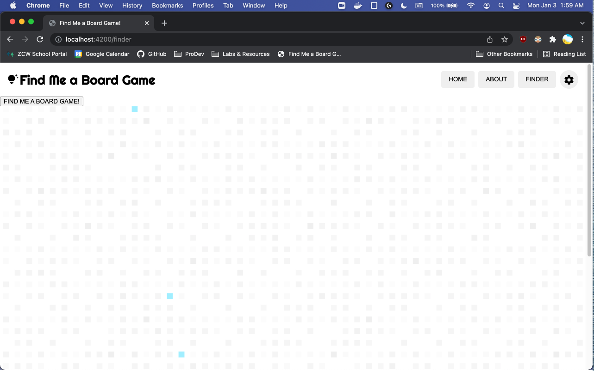
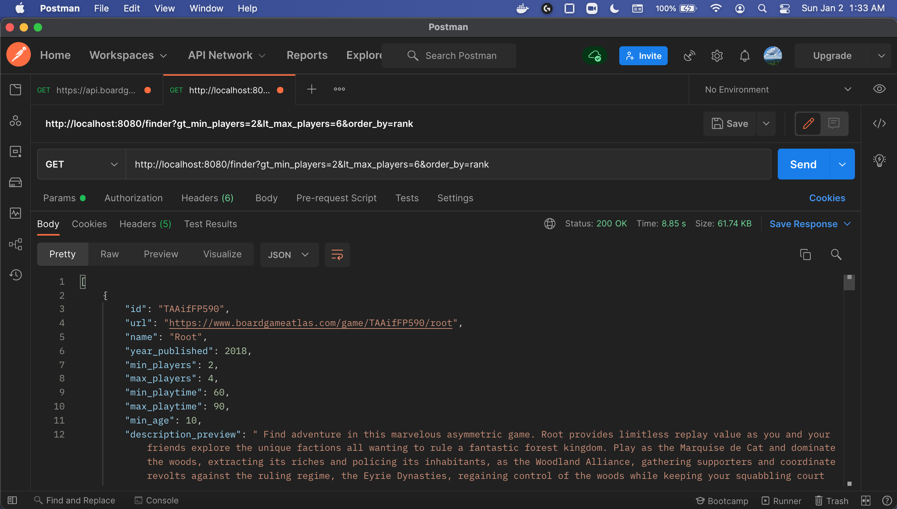
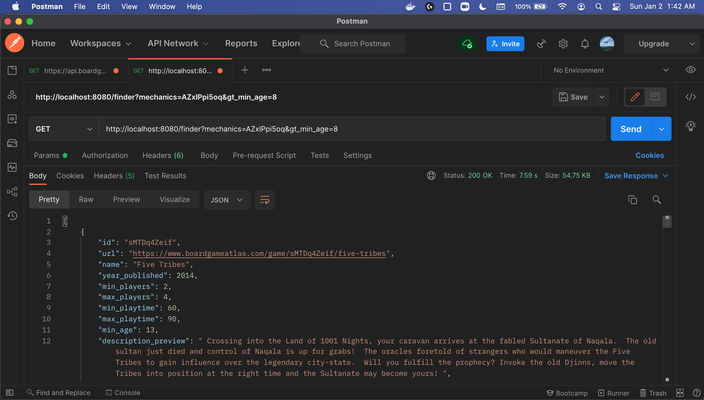
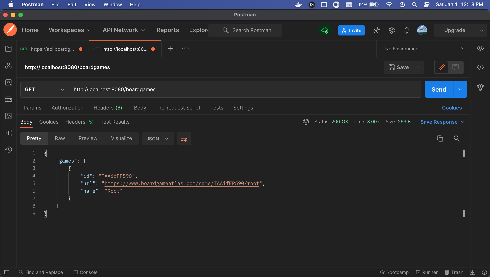
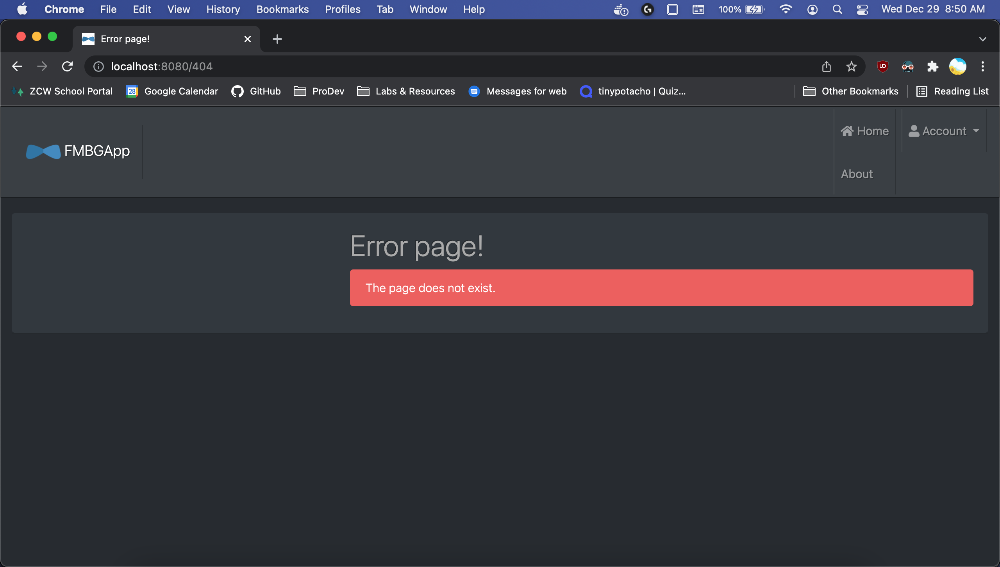
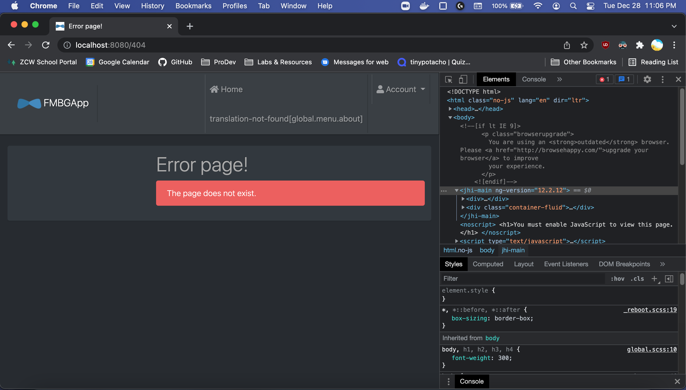

## Daily Progress Log

## 2022-01-16
* Whitelabel Error Page error found, resolved by:
  - Updating outpath in angular.json to `./static`
  - Removed `@EnableWebMvc` in WebConfig.java per: https://stackoverflow.com/questions/24661289/spring-boot-not-serving-static-content/33852040#33852040
    - Updated Resources Handler
  - Updated pom.xml with retrieving static files from angular-fmbg/static output directory and saving to resources/static

## 2022-01-10
* Ran into issue where srping boot was not refreshing static resource files with updated angular index.html
    - fix: changed outPath in angular.json to `../resources/public`
    - need to run `ng build` each time prior to running back end for updates to persist
    - utilized this answer: https://stackoverflow.com/questions/53854541/how-to-package-angular-project-with-springboot-application 

## 2022-01-09
* angular-fmbg import module errors ex. `cannot find module '@angular/router'` resulting from missing `node_modules` package
    - fixed with `npm install` in project folder
* removed test angular app from src dir
* connected front and back end via CORS, enabled web mvc in config file
    - utilized this article to deploy Angular within Spring Boot: https://dev.to/jakmar17/deploying-angular-application-inside-spring-boot-57g7

## 2022-01-08
* Still trying to figure out how to run both front and back ends
* Changing database to PostgreSQL to align with Heroku provided support
* Trying to follow tutorials:
    - https://www.bezkoder.com/angular-12-spring-boot-postgresql/
    - https://programmingtechie.com/2020/10/10/deploy-spring-boot-and-angular-application-to-heroku/ 

### 2022-01-05
* Researching how to deploy a full stack application on Heroku
    - [maybe this?](https://www.codecademy.com/article/deploying-a-full-stack-app-with-heroku)

### 2022-01-04
* Need to fix routing > pages do not change to specified component
    - Edit: Routing is now functioning properly. Next steps are to build out components
* Deployed to Heroku, but need to configure both front and back end to run simultaneously - currently only backend runs (Whitelabel Error Page)

### 2022-01-03
* Front-end in progress
* Need to connect finder with front-end

### 2022-01-02
* Finder appears to function properly with various filters

* Created angular project for front-end, added `@angular/material`

### 2022-01-01
* Happy New Year :)
* Screenshot of successful Postman GET Request of consumed 3rd party API (Board Game Atlas) 

### 2021-12-30
* Switching from BGG XML API to Board Game Atlas API due to API call limitation. BGG API only allows 1 request ~5 seconds (~12 requests per minute) vs. Board Game Atlas allowing 60 requests per minute per client.
* Was able to successfully use Jackson XML to parse BGG XML API, but will not be utilizing.

### 2021-12-29
* Fixed about button text

* Scrapping jhipster and trying to build app from ground up
    - trying to understand each piece from database to back-end to front-end (angular) and how everything connects

### 2021-12-28
* Researched Jackson XML package and was able to extract thumbnail url (see project link in 2021-12-27 > dev branch).
* Added about component, module, and route. Also tried adding button, but running into error page:

### 2021-12-27
* Trying to scrape data from BGG XML API via [`Boardgames-Demo-w-REST`](https://github.com/AmandaJ-Huang/Boardgames-Demo-w-REST.git) and save data into MySQL database